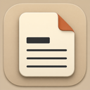

# Markdown Reader

Open a local Markdown file and get a calm, finished document instead of an editor window.

> Everything renders locally. Remote images and document JavaScript are blocked.

## Reader essentials

- [x] GitHub-style tables, task lists, and strikethrough
- [x] Automatic refresh after an external editor saves
- [x] Outline navigation and in-document search
- [x] Light, dark, and sepia appearances
- [x] PDF, HTML, print, and Quick Look support
- [x] Syntax coloring, footnotes, and automatic bare links
- [ ] Built-in editing — intentionally left to your preferred editor

## A compact table

| Feature | Shortcut | Behavior |
|:--|:--:|--:|
| Find | `⌘F` | Native WebKit search |
| Outline | `⌃⌘S` | Show or hide headings |
| Editor | `⌥⌘E` | Open this file elsewhere |
| Source | `⌥⌘\\` | Toggle read-only source |
| Remember | `⇧⌘M` | Save the selected passage explicitly |
| Bookmark | `⇧⌘B` | Save the current heading |
| Reading Memory | `⇧⌘R` | Open the global reading notebook |

## Reading Memory

Select part of this paragraph and press `⇧⌘M` to remember it. Selection alone never saves anything, and the Markdown file remains unchanged. Add a private margin note, edit this file externally, and the reader will either recover the exact passage or ask you to repair its location explicitly.

## Code stays readable

```swift
struct DocumentPreview {
    let source: String
    let isLocalOnly = true
}
```

Inline code such as `xcodebuild test` remains selectable, and wide code blocks scroll without widening the page.

## Security boundary

Raw HTML is displayed as inert text rather than executed:

<script>alert("This cannot run")</script>

External links, such as [Apple’s Swift documentation](https://www.swift.org/documentation/), open in your browser only after you click them.
Bare links work too: https://commonmark.org.

## Local assets and linked notes



Relative images stay local, and [linked Markdown files](Linked.md) open in their own reader window.

## One more section

Use the outline to jump here, then switch between serif and sans body text from Reader Options.[^reading]

[^reading]: Reading preferences apply consistently to the app, Quick Look, printing, and exported documents.
